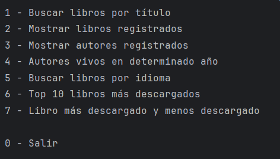
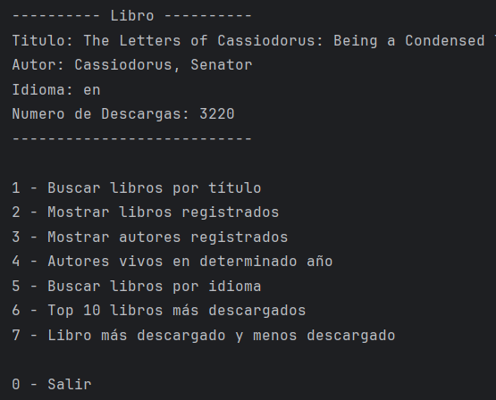
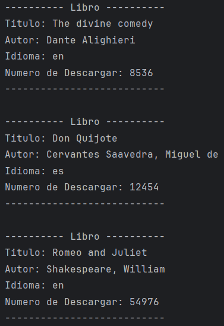
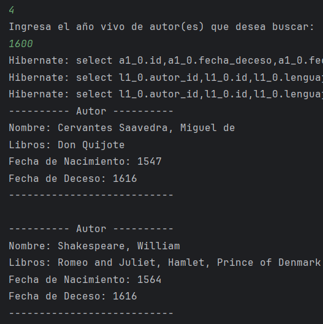
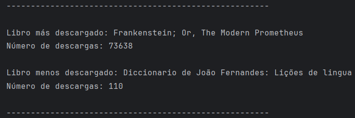
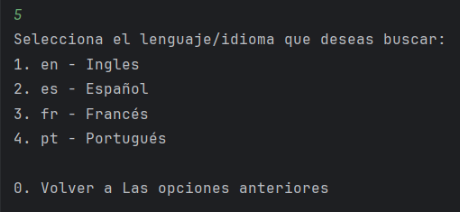

<div style="position: relative; display: inline-block; text-align: center;">
    
    <div style="position: absolute; top: 50%; left: 50%; transform: translate(-50%, -50%);
         color: white; font-size: 30px; font-weight: bold; background-color: rgba(0, 0, 0, 0.5); 
         padding: 10px; font-family: 'Italic', sans-serif;font-style: oblique;">
        Literalura
    </div>
</div>

Literalura es una aplicación de consola desarrollada en Java que permite buscar libros, listar libros y autores, y obtener estadísticas sobre los libros más descargados. La aplicación se conecta a la API de Gutendex para obtener información sobre los libros y utiliza una base de datos PostgreSQL para almacenar los datos.

## Funcionalidades

Posee un menú con las opciones de búsquedas más destacadas:



1. **Buscar libro por título**: Permite a la persona usuaria buscar un libro por su título e insertar la información en la base de datos.
2. **Listar libros registrados**: Muestra todos los libros que han sido registrados en la base de datos.
3. **Listar autores registrados**: Muestra todos los autores que han sido registrados en la base de datos.
4. **Listar autores vivos en un determinado año**: Permite listar los autores que estaban vivos en un año específico.
5. **Listar libros por idioma**: Permite listar los libros por su idioma (ES, EN, FR, PT).
6. **Top 10 libros más descargados**: Muestra los 10 libros más descargados.
7. **Libro más descargado y menos descargado**: Muestra el libro más descargado y el menos descargado.

## Requisitos

- Java 17
- Spring Boot 3.2.4
- PostgreSQL
- Maven

## Instalación

1. Clona el repositorio:
    ```sh
    git clone https://github.com/tu-usuario/tu-proyecto.git
    cd tu-proyecto
    ```

2. Configura la base de datos PostgreSQL y actualiza las credenciales en el archivo `application.properties`.

3. Ejecuta la aplicación:
    ```sh
    ./mvnw spring-boot:run
    ```

## Uso

1. **Buscar un libro**:
    - Ejecuta la aplicación y selecciona la opción 1.
    - Ingresa el título del libro que deseas buscar.




2. **Listar libros**:
    - Selecciona la opción 2 para listar todos los libros registrados.




3. **Listar autores**:
    - Selecciona la opción 3 para listar todos los autores registrados.


4. **Listar autores vivos en un determinado año**:
    - Selecciona la opción 4 y especifica el año.




5. **Listar libros por idioma**:
    - Selecciona la opción 5 y especifica el código del idioma (ES, EN, FR, PT).


6. **Top 10 libros más descargados**:
    - Selecciona la opción 6 para ver los 10 libros más descargados.

7. **Libro más descargado y menos descargado**:
    - Selecciona la opción 7 para ver el libro más descargado y el menos descargado.



## Descripción de las Funcionalidades

### 1. Buscar libro por título
La persona usuaria debe ingresar el nombre del libro que desea buscar. Por ejemplo, si se busca "Pride" (Orgullo), la aplicación debe ir a la API de Gutendex, buscar la información sobre este libro y registrarlo en la base de datos. Si el libro ya está en la base de datos, no se insertará nuevamente.

### 2. Listar libros registrados
Muestra todos los libros que han sido registrados en la base de datos. Por ejemplo, libros como "Don Quixote" (Don Quijote), "Emma", "Pride and Prejudice" (Orgullo y Prejuicio), entre otros.

### 3. Listar autores registrados
Muestra todos los autores que han sido registrados en la base de datos. Por ejemplo, autores como Jane Austen y William Shakespeare.

### 4. Listar autores vivos en un determinado año
Permite listar los autores que estaban vivos en un año específico. Por ejemplo, en el año 1600, autores como Cervantes y Shakespeare estaban vivos.

### 5. Listar libros por idioma
Permite listar los libros por su idioma (ES, EN, FR, PT). Por ejemplo, si se busca por ES, se mostrarán los libros en español.



### 6. Top 10 libros más descargados
Muestra los 10 libros más descargados de la base de datos.

### 7. Libro más descargado y menos descargado
Muestra el libro más descargado y el menos descargado de la base de datos.

## API

La aplicación utiliza la API de Gutendex para obtener información sobre los libros. Más información sobre la API está disponible en [Gutendex API](https://gutendex.com).

## Contribución
Si tienes ideas adicionales o mejoras, no dudes en contactarme. La creatividad es esencial para el desarrollo de software.
